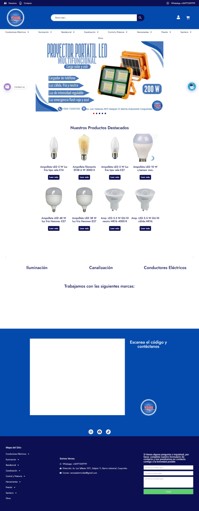
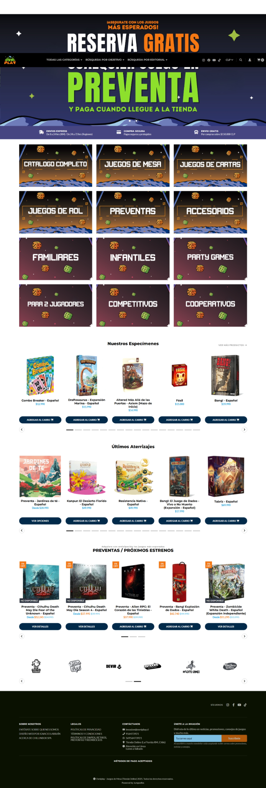
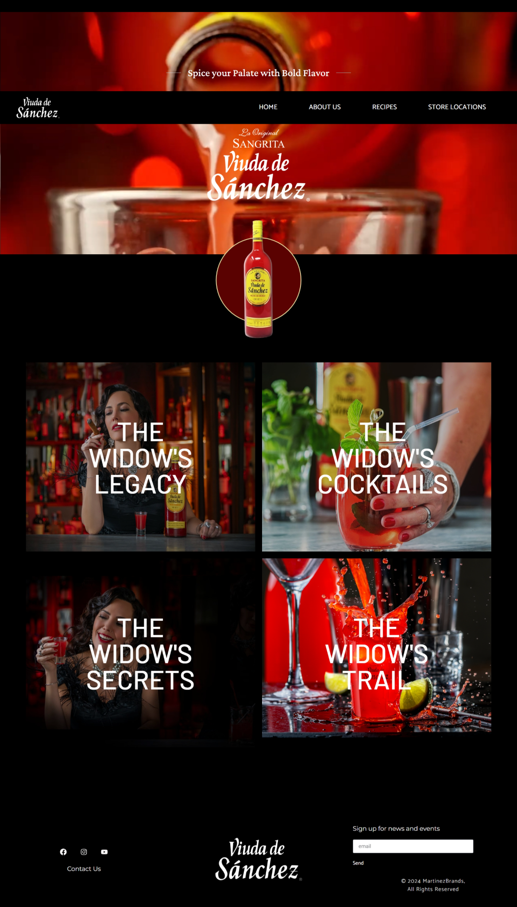
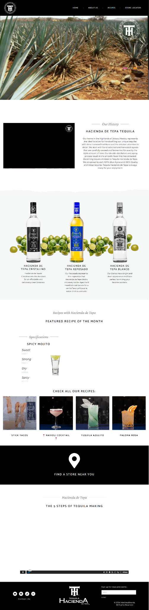
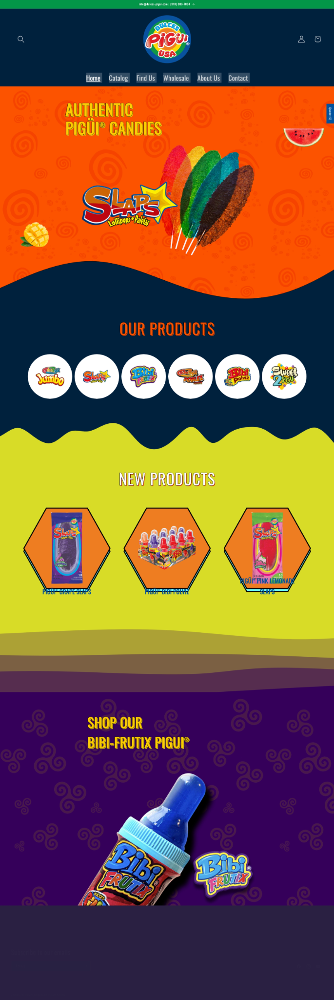

# 👋 Hola, soy Ignacio Larraín

Soy **Desarrollador Full Stack JavaScript** con experiencia en diseño y desarrollo de sitios web en **WordPress (Elementor, WooCommerce)** y **Shopify**, además de certificación en **Full Stack con PERN (PostgreSQL, Express, React, Node)**.  
Actualmente estudio **Analista Programador en INACAP**, donde he profundizado en tecnologías como **SQL, React, Python, Django, MongoDB y Oracle SQL**.  

Me gusta crear soluciones digitales con un enfoque **funcional, estético y centrado en la experiencia del usuario**.

---

## 🛠️ Tecnologías Principales

- **Frontend:** React, JavaScript, HTML5, CSS3, Bootstrap, Elementor.  
- **Backend:** Node.js, Express, Python, Django.  
- **Bases de Datos:** PostgreSQL, MySQL, MongoDB, Oracle SQL.  
- **CMS & eCommerce:** WordPress + WooCommerce, Shopify.  
- **Otros:** GitHub, Firebase, SEO, Responsive Design.  

---

## 🚀 Proyectos Destacados

### 🔌 Veross Electricidad
Tienda online de productos eléctricos, desarrollada en **WordPress + WooCommerce** con un catálogo amplio y categorización.  

  
📸 Ver Screenshot

  

---

### 🎲 Board Game Store
E-commerce especializado en juegos de mesa con preventas y estrenos, implementado en **Shopify**.  

  
📸 Ver Screenshot

  

---

### 🍹 Viuda de Sánchez
Landing page internacional para la marca de bebidas, con diseño atractivo y secciones de recetas.  

  
📸 Ver Screenshot

  

---

### 💡 Luminotecnia
Sitio institucional con catálogo de productos de iluminación, desarrollado en **WordPress + Elementor**.  

  
📸 Ver Screenshot

  

---

### 🍬 Dulces Pigüi
E-commerce vibrante y colorido para marca de dulces mexicana, implementado en **Shopify**.  

  
📸 Ver Screenshot

  

---

### 🧘 Instituto Chileno de Yoga
Plataforma educativa y comercial, con integración de **WooCommerce** para inscripciones y pagos en línea.  

  
📸 Ver Screenshot

  

---

### ⚡ Redintec
Sitio web corporativo orientado a tecnología y servicios TI, construido en **WordPress**.  

  
📸 Ver Screenshot

  

---

### 🎨 A de Agencia
Web creativa para una agencia de marketing, con diseño audaz y dinámico.  

  
📸 Ver Screenshot

  

---

## 📚 Formación

- **Full Stack JavaScript (PERN)** – Certificado.  
- **Analista Programador** – INACAP (en curso).  

---

## 📬 Contacto

- 🌐 [ignaciolarrain.cl](http://www.ignaciolarrain.cl)  
- 💼 [LinkedIn](https://www.linkedin.com/in/ignaciolarrain)  
- 📧 ignaciolarrainv@gmail.com  

---
✨ Gracias por visitar mi portafolio. Siempre abierto a nuevos desafíos y colaboraciones.
